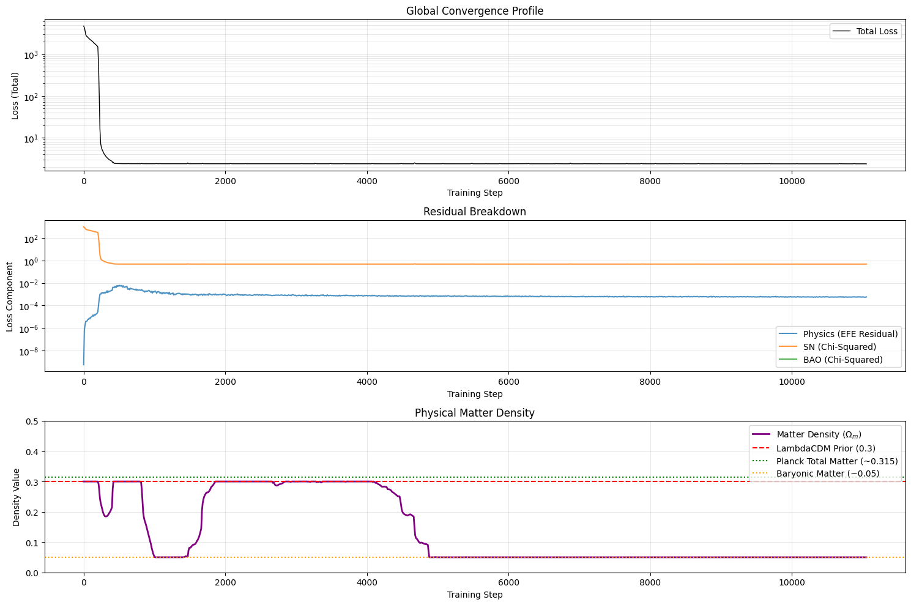
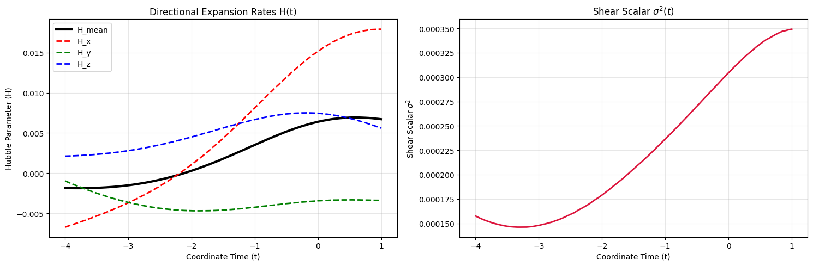
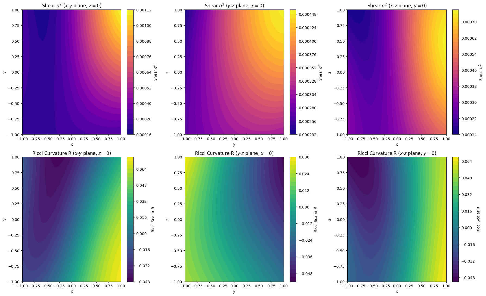

## Weighing the Universe: Matter, Constraints, and Spatial Inhomogeneity

In my [previous post](https://hamon.dev/blog/lumpyspace/), I explored how a
Physics-Informed Neural Network (PINN) could learn the 4D metric tensor of the
universe directly from Pantheon+ Supernova data, constrained by the Einstein
Field Equations (EFE). The model discovered that extreme spatial anisotropy (a
"Cosmological Dipole") could act as a physical mechanism to mimic Dark Energy
in a vacuum universe.

But a vacuum universe is a spherical cow[^0]. And Supernovae, while excellent
standard candles, only give us part of the story. They provide luminosity
distances, which act as a proxy for the expansion history of the universe.

### From Vacuum to Matter

In my first experiment, the vacuum universe was mathematically stable and fit
the EFE and supernova data. However, it did so by falling into a contracting
regime where space actively shrank ($H < 0$), utilizing extreme shear near the
present day as a mathematical cheat code.

While a pure vacuum geometry can technically satisfy the data and the field
equations, it is physically unrealistic (our universe actually has stuff in
it[^1]). If we want the model to discover a realistic cosmology without falling
into contracting local minima, we have to give it the physical vocabulary to
do so: **Matter**.

### A Bounded Parameterization for $\Omega_m$

Normally, in $\Lambda$CDM cosmology, we would plug in a fixed value like
$\Omega_m \approx 0.3$ (about 30% matter, most of which is Dark Matter), a
standard assumption validated by the Planck 2018 results. But we want the
network to dynamically discover the matter density that best balances the field
equations against the data.

So, instead of hardcoding a value, I introduced a trainable matter density
parameter, $\Omega_m$, which represents the matter density fraction today. 

To prevent the optimizer from taking the lazy way out by bloating $\Omega_m$ to
$1.0$ (or higher) to escape into a smooth, homogeneous, matter-heavy metric, we
must restrict $\Omega_m$ to the strict physical window $[0.05, 0.3]$. BBN
anchors our lower baryonic limit at $\approx 0.05$, and gravitational lensing and
galaxy dynamics anchor the maximum (incorporating dark matter) at $\approx 0.3$.

We enforce this strict physical window and ensure healthy training dynamics
using two techniques:

1. **Projected Gradient Descent & Decoupled Optimization:**
   Initially, I tried bounding the parameter using smooth mathematical mappings
   (like sigmoids or double softplus functions). However, these create vanishing
   gradient zones near the boundaries. It was impossible to tell if the model 
   was even trying to drop $\Omega_m$ as the gradients locked the parameter.
   
   To fix this, we stripped away the mappings and optimized the raw $\Omega_m$
   parameter directly, strictly clipping it to $[0.05, 0.3]$ after each step
   using Projected Gradient Descent (PGD).

   But there was another hurdle: the network is a 4-layer, 64-width MLP with
   thousands of parameters, while $\Omega_m$ is a single scalar. During global
   norm gradient clipping (`optax.clip_by_global_norm`), the massive
   dimensionality of the MLP completely swallowed the scalar's gradient updates,
   starving it of any movement. To solve this, we decoupled the optimization.
   Using `optax.multi_transform`, we gave $\Omega_m$ its own dedicated optimizer
   chain with a 100x boosted learning rate and no global norm clipping. This
   allowed the matter density to finally participate in the optimization fairly.

   I debated the initialization of $\Omega_m$ as it might bias the model a
   priori to favour Dark Matter or to avoid it. Ultimately, we initialize 
   $\Omega_m$ exactly at the dark matter ceiling of $0.3$. This gives the 
   newborn universe a smooth, mathematically stable runway to fit the
   expansion data initially, before the EFE residuals might learn to force it to
   develop spatial inhomogeneities and drag the matter density down to the
   baryonic floor.

2. **The Dynamic Cosmology Coupling:**
   Normally, in standard cosmological models, one might assume a fixed value
   for the present-day matter density $\kappa\rho_0$, or assume a static
   relation like $\kappa\rho_0 = 3\Omega_m H_0^2$ using a constant
   approximation for the Hubble parameter (e.g., $H_0 \approx 1$). However,
   since our network dynamically learns the space-time geometry and derives the
   expansion rate $H(t)$ from the metric itself, assuming a static $H_0$ would
   introduce a severe physical inconsistency.

   To ensure that the trainable parameter $\Omega_m$ remains physically
   meaningful and bounded within $[0.05, 0.3]$, we must dynamically couple the
   energy density $\kappa\rho_0$ to the model's own derived expansion rate 
   today, $H_{\text{mean}}(1.0)$:

   $$\kappa \rho_0 = 3 \cdot \Omega_m \cdot H_{\text{mean}}(1.0)^2$$

   By calculating $H_{\text{mean}}(1.0)$ from the spatial metric components at
   each training step, this coupling ensures that the matter density parameter
   $\Omega_m$ we tune is exactly the physical density fraction today. As the
   universe expands, this pressureless dust field dilutes as a function of the
   spatial metric determinant ($V \propto \sqrt{\gamma}$). By subtracting
   this matter field's Stress-Energy tensor ($T_{\mu\nu}$) from the Einstein
   tensor ($G_{\mu\nu}$), the physics loss can account for the presence
   of mass.

### Enforcing the Weak Energy Condition

When matter density is added to the system, general relativity expects it to
behave physically. In comoving coordinates, pressureless dust has a
Stress-Energy tensor trace of $T = -\rho$. The contracted Einstein Field
Equations then dictate:

$$R = \kappa \rho$$

Since physical matter density must be non-negative ($\rho \ge 0$), the local
spacetime curvature (the Ricci scalar $R$) must also be non-negative ($R \ge 0$)
everywhere.

However, because the neural network only minimizes EFE residuals, it initially
found an unphysical shortcut: it created regions of negative Ricci curvature
($R < 0$, corresponding to negative energy density) to fit the accelerating
expansion of the supernovae without dark energy. To prevent this, I added a
squared flat minimum penalty to the EFE loss:

$$\mathcal{L}_{\text{WEC}} = \text{mean}(\min(R, 0.0)^2)$$

This enforces the Weak Energy Condition smoothly, leaving physical
positive-curvature regions completely unbothered while shutting down any
negative-mass cheat codes.

### Results and Physical Interpretation

With the physical constraints and decoupled optimizer active, we ran the
supernova-only training loop. To understand what kind of universe the model
discovered, we examine the convergence profile, the directional expansion
rates over time, and the spatial maps today ($t=1.0$).

#### 1. The Optimization Trajectory: Shedding Dark Matter

The first question is: how does the network tune the matter density when given
the freedom to do so?

As shown in the bottom panel above, the dynamically optimized $\Omega_m$
parameter plummeted from its $0.3$ initialization (the dark matter ceiling)
straight down to the baryonic floor of $\approx 0.05$.

This is a profound result. When the optimizer is forced to reconcile the
supernova data with the Einstein Field Equations, it actively rejects the
presence of dark matter. It finds that the field equations are much easier
to satisfy if the universe is dominated by spatial inhomogeneities rather than
a smooth, heavy background of cold dark matter.

#### 2. Cosmic Shear and Anisotropic Expansion

Next, we look at how the expansion rate evolves over coordinate time $t$ (from
the early universe at $t=-4.0$ to today at $t=1.0$):

The plots reveal a highly dynamic and anisotropic expansion history:
* **Diverging Hubble Rates**: In the left panel, the directional expansion
  rates ($H_x, H_y, H_z$) begin tightly clustered in the early universe,
  reflecting our isotropic boundary conditions. However, as time progresses,
  they diverge dramatically. Today ($t=1.0$), the expansion is fast in some
  directions and slow in others.
* **Late-Time Shear Peak**: The right panel shows the shear scalar
  $\sigma^2(t)$ peaking near the present day. Because shear enters the
  field equations as an effective energy density term with negative pressure,
  this late-time spike in shear is precisely the mechanism the network uses
  to mimic the accelerating expansion rate normally attributed to Dark Energy.

#### 3. Spatial Curvature and Shear Maps Today

To visualize the three-dimensional geometry of the universe today, we mapped
the shear scalar $\sigma^2$ and the Ricci curvature scalar $R$ across all three
principal planes ($x$-$y$, $y$-$z$, and $x$-$z$, with the third coordinate set
to 0):

These maps reveal a clear and fascinating picture of spatial inhomogeneity:
* **The Curvature Dipole**: The Ricci scalar curvature $R$ (bottom row) is not
  uniform; it forms a distinct spatial gradient (a cosmic dipole) swinging from
  flat/negative regions to positively curved regions. This represents a
  massive spatial inhomogeneity (a "lumpy" density distribution) along our
  line of sight that the model has developed natively from the data.
* **Inhomogeneous Shear**: The shear scalar $\sigma^2$ (top row) peaks in
  specific spatial lobes, aligning with the directional expansion gradients.

By letting the matter density and metric evolve freely under pure General
Relativity, the network independently demonstrated that the Pantheon+
supernova data can indeed be fit without a cosmological constant (Dark
Energy) *and* without Dark Matter, provided we allow the universe to be
inhomogeneous and anisotropic along our line of sight.

It is worth noting that to a neural network, the laws of physics are merely
suggestions. Because our WEC penalty (and our assumption of zero shear in
the early universe) are implemented as *soft* constraints, the optimizer
strikes a mathematical compromise. There is a slight residual negative
curvature and non-zero early shear in the final plots as the network
balances physical laws against the raw data loss. More on this next...

[^0]: and, more importantly, doesn't give us anywhere to leave our stuff!

[^1]: and ourselves somewhere to live.
